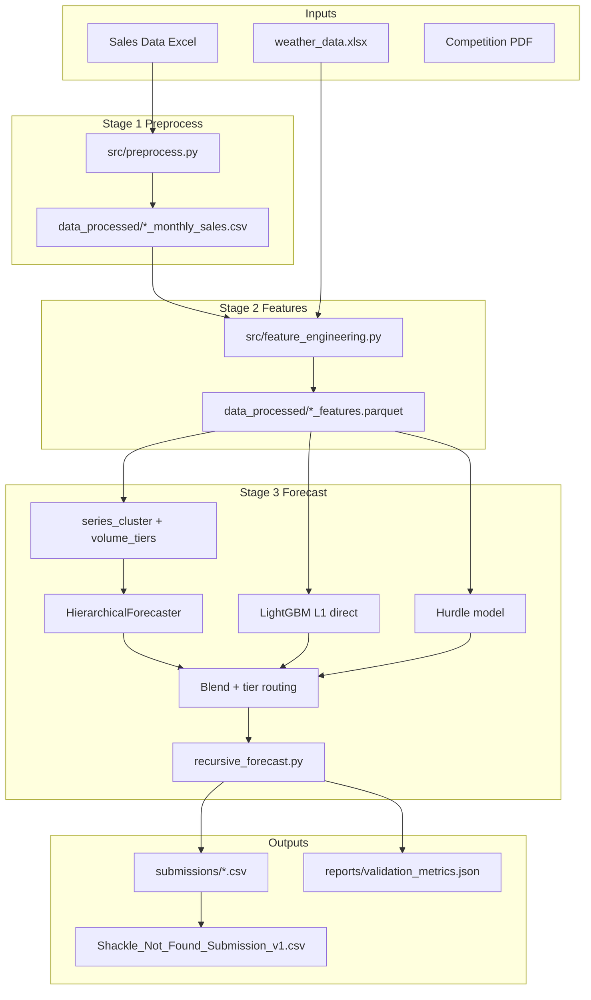

# CGCEL Demand Forecasting — Shackle Not Found

End-to-end machine learning pipeline for **Crompton Greaves Consumer Electricals Ltd. (CGCEL)** monthly demand forecasting at **Branch × SKU** granularity across four product lines: **Fans**, **LDA** (Large Domestic Appliances), **Pumps**, and **SDA** (Small Domestic Appliances).

This repository produces competition-ready submissions, reproducible validation metrics, and a documented methodology aligned with the CGCEL hackathon brief.

---

## Team

**Team name:** Shackle Not Found
**Team members:** PhaniBhushan & Aryan Shrivastava

---

## Table of contents

1. [Problem statement](#problem-statement)
2. [Repository layout](#repository-layout)
3. [Prerequisites](#prerequisites)
4. [Installation](#installation)
5. [Data requirements](#data-requirements)
6. [Quick start](#quick-start)
7. [Pipeline architecture](#pipeline-architecture)
8. [Stage 1: Preprocessing](#stage-1-preprocessing)
9. [Stage 2: Feature engineering](#stage-2-feature-engineering)
10. [Stage 3: Forecasting](#stage-3-forecasting)
11. [Validation and metrics](#validation-and-metrics)
12. [Outputs](#outputs)
13. [Configuration](#configuration)
14. [Current performance](#current-performance)
15. [Approach document and notebook](#approach-document-and-notebook)
16. [Troubleshooting](#troubleshooting)
17. [References](#references)

---

## Problem statement

CGCEL needs accurate **monthly demand forecasts** at the **sales office (branch) × SKU** level to support inventory planning, production scheduling, and regional allocation. Demand is:

- **Highly sparse** — roughly 76–83% of branch×SKU months have zero sales
- **Seasonal** — weather (fans, coolers) and festivals (Diwali, Holi, etc.) drive spikes
- **Hierarchical** — SKUs roll up to segments, offices, and regions

The competition asks for **four months of forecasts** (January–April 2026) in a fixed CSV schema, judged primarily on **WAPE** (Weighted Absolute Percentage Error).

**Important:** Lower WAPE is better. WAPE of 80% means total absolute error is about 80% of total actual demand — not “80% accuracy.”

---

## Repository layout

```
Crompton_Hackathon/
├── Demand Forecasting Competition (1) (1).pdf   # Official competition brief
├── Sales Data/                                   # Raw inputs (required, not in git)
│   ├── Fans_Data.xlsx
│   ├── LDA_Data.xlsx
│   ├── Pumps_Data.xlsx
│   ├── SDA_Data.xlsx
│   └── weather_data.xlsx
├── src/
│   ├── config.py                 # Paths, dates, feature lists, state mapping
│   ├── preprocess.py             # Excel → monthly sales CSVs
│   ├── feature_engineering.py    # Full grid + lags + weather + festivals
│   ├── series_cluster.py         # dead / intermittent / stable labels
│   ├── volume_tiers.py           # top10 / mid / tail by volume
│   ├── recursive_forecast.py     # Multi-step lag updates (Jan–Apr 2026)
│   ├── train_pipeline.py         # Main orchestrator (CLI entry point)
│   ├── evaluate.py               # Rolling validation folds
│   ├── tuning.py                 # Blend-weight grid search
│   ├── metrics.py                # WAPE helpers
│   └── models/
│       ├── baselines.py          # lag-1, rolling-3, Croston/TSB
│       ├── hurdle.py             # P(demand>0) + L1 regressor
│       ├── hierarchical.py       # Segment×office LGBM + SKU allocation
│       └── blend.py              # Ensemble weighting
├── data_processed/               # Generated (gitignored)
├── models/artifacts/             # Per-category tuning JSON (gitignored)
├── submissions/                  # Per-category prediction CSVs
├── reports/
│   └── validation_metrics.json
├── Shackle_Not_Found_Submission_v1.csv   # Combined submission file
├── reproduce_forecasting.ipynb
├── Approach_Document.md          # Methodology for judges
├── requirements.txt
└── README.md
```

---

## Prerequisites

| Requirement | Details |
|-------------|---------|
| **Python** | 3.9+ (3.10+ recommended) |
| **RAM** | ≥ 8 GB (Fans feature grid ~2M rows) |
| **Disk** | ~2 GB free for `data_processed/` parquet files |
| **Raw data** | `Sales Data/` folder with five Excel files (see below) |

---

## Installation

Clone or download the repository, place raw data under `Sales Data/`, then install dependencies:

```bash
cd Crompton_Hackathon
pip install -r requirements.txt
```

**Dependencies** (`requirements.txt`):

- `pandas`, `numpy` — data handling
- `lightgbm`, `scikit-learn` — models
- `statsmodels` — optional statistical baselines
- `openpyxl` — Excel I/O
- `pyarrow` — Parquet feature storage

---

## Data requirements

Place these files in **`Sales Data/`** (paths are configured in `src/config.py`):

| File | Contents |
|------|----------|
| `Fans_Data.xlsx` | Daily sales (2022–2026), geography, festival calendar |
| `LDA_Data.xlsx` | LDA sales + geography |
| `Pumps_Data.xlsx` | Pumps sales + geography |
| `SDA_Data.xlsx` | SDA sales + geography |
| `weather_data.xlsx` | Daily temperature, cooling/heating degree days, precipitation by office |

The pipeline:

1. De-anonymizes state names via geography master + hash mapping (Fans/LDA/Pumps)
2. Aggregates daily transactions to **monthly** demand per branch×SKU
3. Preserves **negative quantities** (returns) in monthly sums

---

## Quick start

### Full pipeline (preprocess → features → train → submit)

```bash
python -m src.train_pipeline
```

Runtime: roughly **15–25 minutes** on a typical laptop (Fans feature build is the slowest step).

### Forecast only (skip preprocess/features if already built)

```bash
python -m src.train_pipeline --forecast-only
```

Runtime: roughly **2–3 minutes** per full four-category run.

### Retune ensemble blend weights (Q3 + Q4 2025 folds)

```bash
python -m src.train_pipeline --forecast-only --tune
# Or skip preprocess/features when parquet already exists:
python -m src.train_pipeline --tune-only
```

Writes tuned weights to `models/artifacts/{Category}_tuning.json`.

### Single product line

```bash
python -m src.train_pipeline --forecast-only Pumps
```

Valid categories: `Fans`, `LDA`, `Pumps`, `SDA`.

---

## Pipeline architecture



**Design principle:** Forecast reliable **aggregate levels** (segment × office), allocate to SKUs via historical shares, and blend with **direct SKU LightGBM** models for high-volume series — while forcing **zeros** on sparse tail series when there was no recent sale.

---

## Stage 1: Preprocessing

**Script:** `src/preprocess.py`

**What it does:**

- Loads daily sales sheets per category (sheet names differ by product line)
- Cleans `SalesOfficeCode` (drops invalid codes like `#T/A`, `Tot FouTd`)
- Merges **Geography Master** for region and de-anonymized state (`SalesOffice_Name`)
- Aggregates to monthly `Demand` grouped by:
  - `Year`, `Month_Name`, `Region`, `SalesOfficeCode`, `SalesOffice_Name`, `Segment`, `SKU_Code`

**Run standalone:**

```bash
python -m src.preprocess
```

**Outputs:**

```
data_processed/Fans_monthly_sales.csv
data_processed/LDA_monthly_sales.csv
data_processed/Pumps_monthly_sales.csv
data_processed/SDA_monthly_sales.csv
```

---

## Stage 2: Feature engineering

**Script:** `src/feature_engineering.py`

**What it does:**

1. Builds a **complete chronological grid** (Apr 2022 – Apr 2026) for every active branch×SKU combination; missing months filled with demand = 0.
2. Engineers **lag features** (1, 2, 3, 12 months) and rolling statistics on lag-1 demand (no leakage from current month).
3. Adds **intermittency** features: months since last sale, nonzero counts, ADI.
4. Adds **target encodings** (expanding means, lagged): SKU×office, segment×office, global SKU.
5. Merges **weather** (monthly aggregates + climatology imputation before May 2024).
6. Merges **festival** flags (Diwali, Holi, Eid, Durga/Dussehra).
7. Adds **YoY ratio**, **segment share lag**, **festival lags**.

**Run standalone:**

```bash
python -m src.feature_engineering
```

**Outputs:**

```
data_processed/{Category}_features.parquet
```

Parquet is used for fast reload during training (~2M rows for Fans).

---

## Stage 3: Forecasting

**Script:** `src/train_pipeline.py` (orchestrator)

### Training window

| Split | Period |
|-------|--------|
| History / features | Apr 2022 – Apr 2026 |
| Model training | Apr 2023 – Dec 2025 |
| Internal tuning | Oct – Dec 2025 |
| Holdout validation | Jan – Mar 2026 (recursive) |
| **Submission horizon** | **Jan – Apr 2026** |

### Model components

#### 1. Hierarchical forecaster (`src/models/hierarchical.py`)

- Trains **LightGBM L1** on **segment × office** monthly aggregated demand
- Recursively forecasts segment totals for Jan–Apr 2026
- Allocates to SKUs using **smoothed historical shares** (last 12 months + segment-global shrinkage)
- **Reconciles** so SKU predictions sum to segment forecasts within each office

#### 2. Direct SKU LightGBM

- **L1 loss** (`regression_l1`) — aligned with WAPE under sparsity
- Trained on full feature set including categoricals (`Region`, `SalesOfficeCode`, `Segment`, `sku_bucket`)

#### 3. Hurdle model (`src/models/hurdle.py`)

- **Classifier:** P(demand > 0)
- **Regressor:** L1 on positive-demand rows only
- **Threshold τ:** predict quantity only if P(sale) ≥ τ (tuned to avoid small false positives on zero months)

#### 4. Statistical baselines (`src/models/baselines.py`)

- lag-1, rolling-3 means
- **Croston SBA** for intermittent series (batch implementation)

### Series routing

| Label | Rule | Forecast policy |
|-------|------|-----------------|
| **dead** | No sales in last 6 months | Predict **0** |
| **intermittent** | Low nonzero rate or high ADI | Baseline / hurdle / hierarchy mix |
| **stable** | Regular demand | Full LGBM + hierarchy blend |

| Volume tier | Rule | Policy |
|-------------|------|--------|
| **top10** | Top ~10% of series by last-12-month volume (~95%+ of demand) | Full ensemble (LGBM + hierarchy + hurdle) |
| **mid** | Middle tier | 55% direct blend + 45% hierarchy |
| **tail** | Long tail | **Hierarchy if lag-1 > 0, else 0** |

### Per-category strategy (defaults in `src/tuning.py`)

| Category | Strategy | Typical blend |
|----------|----------|---------------|
| **Pumps** | `lgbm_primary` | 85% LGBM, 15% hierarchy |
| **SDA** | `hurdle_blend` | 45% hurdle, 35% LGBM, 20% hierarchy |
| **Fans** | `hierarchy_blend` | 65% LGBM, 20% hierarchy, 15% hurdle |
| **LDA** | `hierarchy_blend` | 70% LGBM, 20% hierarchy, 10% hurdle |

Optional experimental strategy: `segment_only` (SKU forecasts = hierarchy allocation only).

### Recursive forecasting

**Script:** `src/recursive_forecast.py`

For each month from Jan–Apr 2026:

1. Update `demand_lag_1/2/3/12` and rolling features from **predicted** prior months (not actuals).
2. Run `predict_fn` to produce that month’s `Predicted_Demand`.
3. Store predictions for use as lags in subsequent months.

This matches true production forecasting and is stricter than one-shot validation with future lags.

---

## Validation and metrics

### WAPE definition

```
WAPE = Σ |actual − predicted| / Σ actual
```

Reported as a percentage in `reports/validation_metrics.json` (`wape_pct`).

### Holdout protocol

- **Primary holdout:** Jan–Mar 2026, recursive multi-step
- **Tuning fold:** Oct–Dec 2025 (blend weights, hurdle threshold)
- **Additional folds** (in `src/evaluate.py`): Jul–Sep 2025, Oct–Dec 2025

### Metrics file structure

After a run, see `reports/validation_metrics.json`:

```json
{
  "mean_wape_pct": 80.81,
  "categories": {
    "Pumps": {
      "wape_pct": 61.21,
      "strategy": "lgbm_primary",
      "blend_weights": { "lgbm": 0.85, "hierarchical": 0.15, ... },
      "detail": {
        "wape_2026_01": 65.46,
        "wape_tier_top10": 59.42,
        "wape_tier_tail": 101.61
      }
    }
  }
}
```

---

## Outputs

### Competition submission

**File:** `Shackle_Not_Found_Submission_v1.csv`

| Column | Description |
|--------|-------------|
| `Year` | e.g. 2026 |
| `Month Name` | Full month name, e.g. January |
| `Region` | Sales region |
| `SalesOffice Code` | Branch / office code |
| `SalesOffice Nme` | State / office name (competition spelling) |
| `Segment` | Product segment |
| `SKU_Code` | SKU identifier |
| `Predicted_Demand` | Non-negative forecast quantity |

Naming convention from brief: `TeamName_Submission_v1.csv` → **Shackle_Not_Found_Submission_v1.csv**.

### Per-category files

```
submissions/Fans_predictions.csv
submissions/LDA_predictions.csv
submissions/Pumps_predictions.csv
submissions/SDA_predictions.csv
```

### Generated artifacts (gitignored)

```
data_processed/          # Monthly CSV + feature Parquet
models/artifacts/        # {Category}_tuning.json after --tune
```

---

## Configuration

Central settings live in **`src/config.py`**:

| Setting | Value | Meaning |
|---------|-------|---------|
| `TRAIN_START` | 2023-04-01 | First month used for model training |
| `FORECAST_START` | 2026-01-01 | First forecast month |
| `FORECAST_END` | 2026-04-01 | Last forecast month (inclusive in target grid) |
| `CATEGORIES` | Fans, LDA, Pumps, SDA | Product lines processed |
| `BASE_FEATURES` | See file | Model input columns |
| `STATE_MAPPING` | Hash → state name | De-anonymization for hashed states |

To change team or submission filename, edit `TEAM_NAME` and `SUBMISSION_FILE` in `config.py`.

---

## Current performance

**Holdout WAPE — Jan–Mar 2026, recursive (honest, no future-month lag leakage):**

| Category | WAPE | Notes |
|----------|------|-------|
| **Pumps** | **61.21%** | Best line; LGBM-primary |
| **SDA** | **78.29%** | Hurdle blend |
| **Fans** | **90.46%** | Large SKU×office grid |
| **LDA** | **93.28%** | Intermittent; improved vs early pipeline |
| **Mean** | **80.81%** | Across four categories |

**Interpretation:**

- **Top 10% volume tier** WAPE is typically **~60–85%** (most business volume).
- **Tail tier** WAPE remains **~100%+** — sparse series dominate row count but not volume.
- Mean WAPE near **81%** is realistic for SKU×branch×month; **1% WAPE** is not achievable at this granularity with available data.

Re-run metrics after any code change:

```bash
python -m src.train_pipeline --forecast-only
cat reports/validation_metrics.json
```

---

## Approach document and notebook

| Asset | Purpose |
|-------|---------|
| [`Approach_Document.md`](Approach_Document.md) | Formal write-up for competition judges (methodology, EDA, validation, business insights) |
| [`reproduce_forecasting.ipynb`](reproduce_forecasting.ipynb) | Jupyter notebook to run the pipeline and inspect metrics |
| [`Demand Forecasting Competition (1) (1).pdf`](Demand%20Forecasting%20Competition%20(1)%20(1).pdf) | Official rules, schema, judging criteria |

**Judging weights (from brief):** Forecast accuracy (WAPE/RMSE) 40%, methodology 25%, code quality 15%, business insights 10%, documentation 10%.

---

## Troubleshooting

### `ModuleNotFoundError: lightgbm` (or other packages)

```bash
pip install -r requirements.txt
```

### `FileNotFoundError` for Sales Data

Ensure Excel files are in `Sales Data/` relative to the repo root, with exact filenames as listed above.

### Out of memory on Fans

1. Run one category at a time: `python -m src.train_pipeline --forecast-only Fans`
2. Ensure `data_processed/Fans_features.parquet` exists (run feature engineering once)
3. Close other applications; Fans grid has ~2M rows

### Pipeline slow on first run

- Preprocessing reads large Excel files (~1.3M rows Fans daily data)
- Feature engineering loops all branch×SKU series for intermittency
- Subsequent `--forecast-only` runs are much faster

### WAPE worse than expected

- Confirm you are comparing **recursive** holdout (Jan–Mar 2026), not one-shot predictions with actual future lags (which leak information and look artificially better on Feb/Mar)
- Check `reports/validation_metrics.json` for per-month and per-tier breakdown

### Stale tuning artifacts

Delete cached weights and re-run:

```bash
rm -f models/artifacts/*_tuning.json
python -m src.train_pipeline --forecast-only --tune
# Or skip preprocess/features when parquet already exists:
python -m src.train_pipeline --tune-only
```

---

## References

- Ke, G. et al. (2017). *LightGBM: A Highly Efficient Gradient Boosting Decision Tree.*
- Hyndman, R. J., & Athanasopoulos, G. (2021). *Forecasting: Principles and Practice* — hierarchical forecasting and intermittent demand.
- Croston, J. D. (1972). Forecasting and stock control for intermittent demands.
- CGCEL Demand Forecasting Competition brief — `Demand Forecasting Competition (1) (1).pdf`

---  

For questions about methodology, see `Approach_Document.md`. For execution issues, start with `python -m src.train_pipeline` and inspect `reports/validation_metrics.json`.
